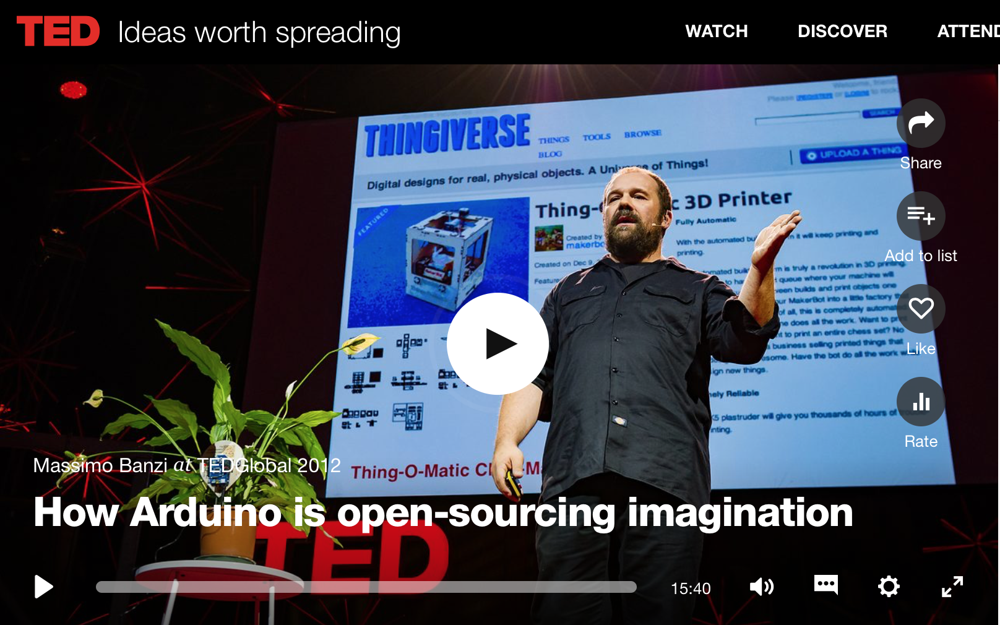

## Materials 

Watch [Massimo Banzi's TED talk with title ""How Arduino is open-sourcing imagination"](https://www.ted.com/talks/massimo_banzi_how_arduino_is_open_sourcing_imagination).

[](https://www.ted.com/talks/massimo_banzi_how_arduino_is_open_sourcing_imagination).


## Pre-lab Questions
```
Q. What is Arduino? 
Q. Why did they make Arduino and its platform?
Q. What do you want to make using Arduino?
```

## Exercise
```
Prepare a 5-min presentation to introduce Arduino to kids.
```
