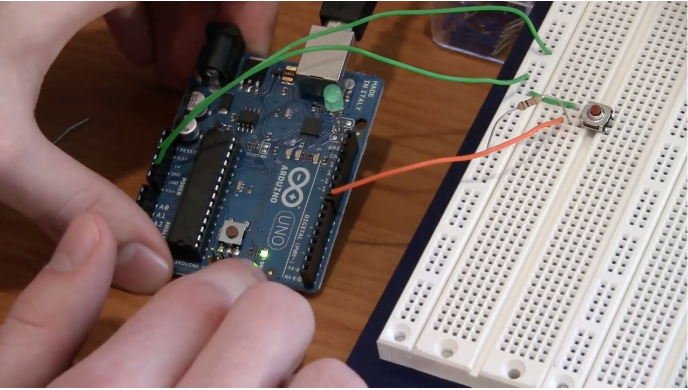

## Buttons, PWM, and Functions

*Before coming to the lab session*, watch [this tutorial](https://www.youtube.com/watch?v=_LCCGFSMOr4).

[](https://www.youtube.com/watch?v=_LCCGFSMOr4).


## Pre-lab Questions

Write a pre-lab report by answering the following questions. Submit it BEFORE the beginning of the class.

```
Q. Draw a circuit to read Button's state. Explain the circuit you designed.
Q. Why do you need the "debounce" function?
Q. What is PWM?
```

## Exercise
Follow the tutorial and write a report using [the template](http://www.writing.utoronto.ca/advice/specific-types-of-writing/lab-report)

## Reference
The codes for the tutorial can be found [here](https://www.jeremyblum.com/2011/01/10/arduino-tutorial-2-now-with-more-blinky-things/) and [here](https://github.com/sciguy14/Exploring-Arduino/tree/master/Chapter%2002).

Also uploaded here: 
* [switch1](switch1.pde)
* [switch2](switch2.pde)
* [switch3](switch3.pde) with debounce
* [switch4](switch4.pde) analog output with PWM
