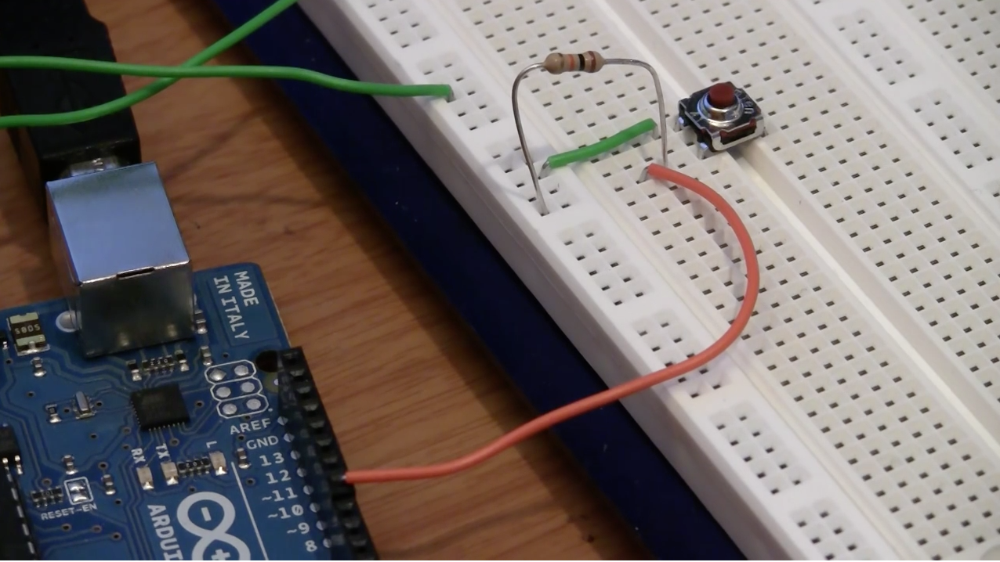
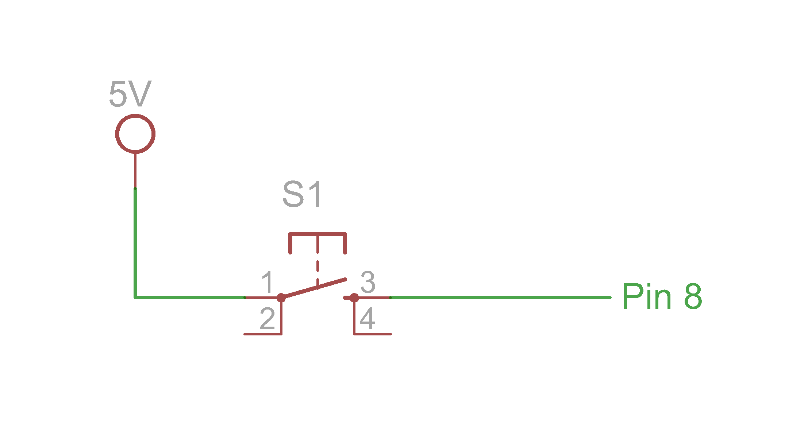

## EE Basics

*Before coming to the lab session*, watch [this tutorial](https://www.youtube.com/watch?v=abWCy_aOSwY).

[](https://www.youtube.com/watch?v=abWCy_aOSwY).


## Pre-lab Questions

Write a pre-lab report by answering the following questions. Submit it BEFORE the beginning of the class.

```
Q1. What happens if you hook up an LED from 5V to GND. What should you do to fix the problem?
Q2. What is the voltage devider? When do you use it?
Q3. What is the problem with the following circuit? How can you fix it?
```


## Exercise
Follow the tutorial and write a report using [the template](http://www.writing.utoronto.ca/advice/specific-types-of-writing/lab-report)

## Reference
The codes for the tutorial can be found [here](https://www.jeremyblum.com/2011/01/17/electrical-engineering-basics-in-arduino-tutorial-3/).

Also uploaded here: 
* [read_button](read_button.pde)
* [read_pot](read_pot.pde)
