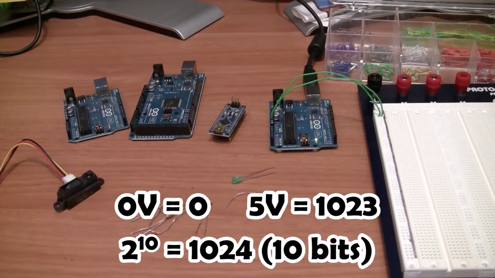

## Analog Inputs

*Before coming to the lab session*, watch [this tutorial](https://www.youtube.com/watch?v=js4TK0U848I).

[](https://www.youtube.com/watch?v=js4TK0U848I).


## Pre-lab Questions

Write a pre-lab report by answering the following questions. Submit it BEFORE the beginning of the class.

```
Q1. 
Q2. 
Q3. 
```


## Exercise
Follow the tutorial and write a report using [the template](http://www.writing.utoronto.ca/advice/specific-types-of-writing/lab-report)

## Reference
The codes for the tutorial can be found [here](https://www.jeremyblum.com/2011/01/24/arduino-tutorial-4-analog-inputs//).

Also uploaded here: 
* [control_led](control_led.pde)
* [detect_threshold](detect_threshold.pde)
* [motion_and_light_sense](motion_and_light_sense.pde)
* [read_sensor](read_sensor.pde)
