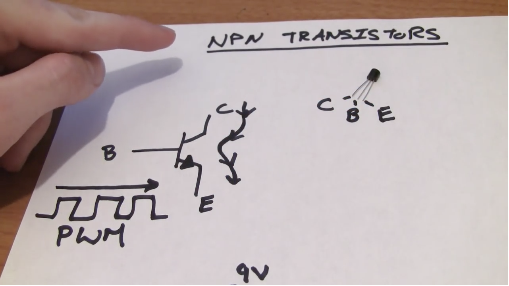

## Motors and Transistors
*Before coming to the lab session*, watch [this tutorial](https://youtu.be/5bHPKU4ybHY).
[](https://youtu.be/5bHPKU4ybHY).


## Pre-lab Questions

Write a pre-lab report by answering the following questions. Submit it BEFORE the beginning of the class.
```
Q1. Why do we use transistor to control a motor (instead of directly control it)?

Q2. Explain how to use NPN transistor to control a motor. 

Q3. Explain the difference between DC and servo moters.
```


## Exercise
Follow the tutorial and write a report using [the template](http://www.writing.utoronto.ca/advice/specific-types-of-writing/lab-report)

## Reference
The codes for the tutorial can be found [here](https://www.jeremyblum.com/2011/01/31/arduino-tutorial-5-motors-and-transistors/).

Source codes:
* [motor_test.pde](motor_test.pde)
* [servo_test.pde](servo_test.pde)
* [ir_servo_control.pde](ir_servo_control.pde)
