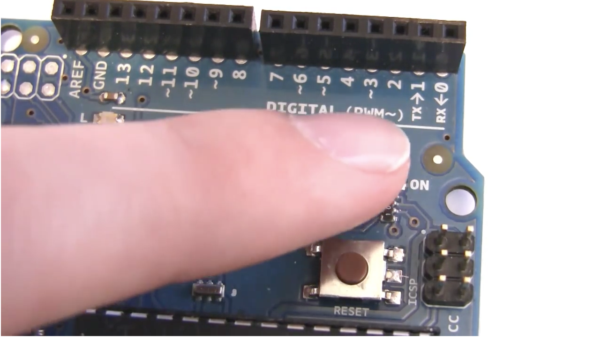

## Serial Communication and Processing


*Before coming to the lab session*, watch [this tutorial](https://youtu.be/g0pSfyXOXj8).
[](https://youtu.be/g0pSfyXOXj8).


## Pre-lab Questions
```
Q. Explain how Arduino communicate with a computer using serial communication.
Q. Write Arduino code to convert a 10-bit number to a 8-bit number. (hint: Use `map` function.)
Q. Visit [Process example page](https://processing.org/examples/) and find an example you want to try.
```


## Exercise
Follow the tutorial and write a report using [the template](http://www.writing.utoronto.ca/advice/specific-types-of-writing/lab-report)

## Reference
The codes for the tutorial can be found [here](https://www.jeremyblum.com/2011/02/07/arduino-tutorial-6-serial-communication-and-processing/).

Source codes are also uploaded here: 
* [keyboard_control_fail.pde](keyboard_control_fail.pde)
* [keyboard_control.pde](keyboard_control.pde)
* [read_pot_and_send.pde](read_pot_and_send.pde)
* [process_input.pde](process_input.pde)


